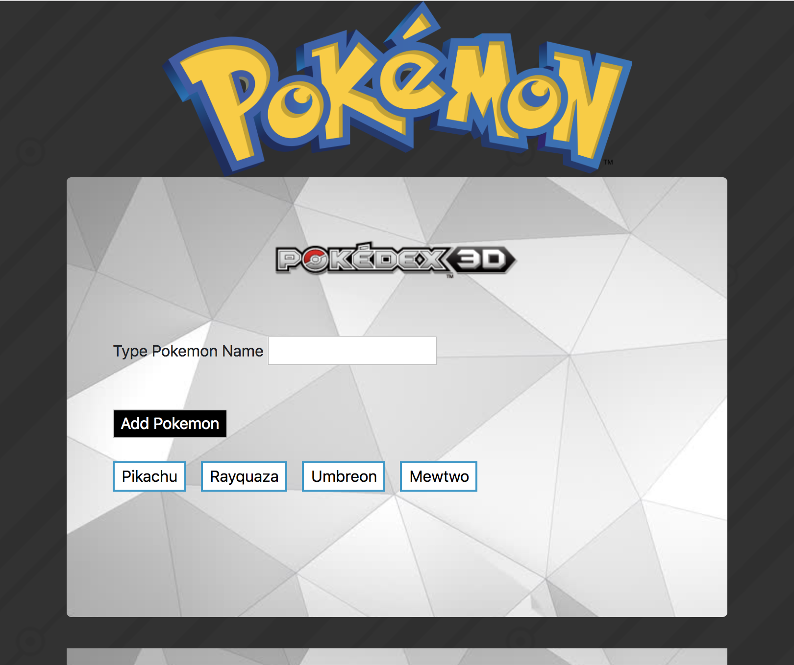
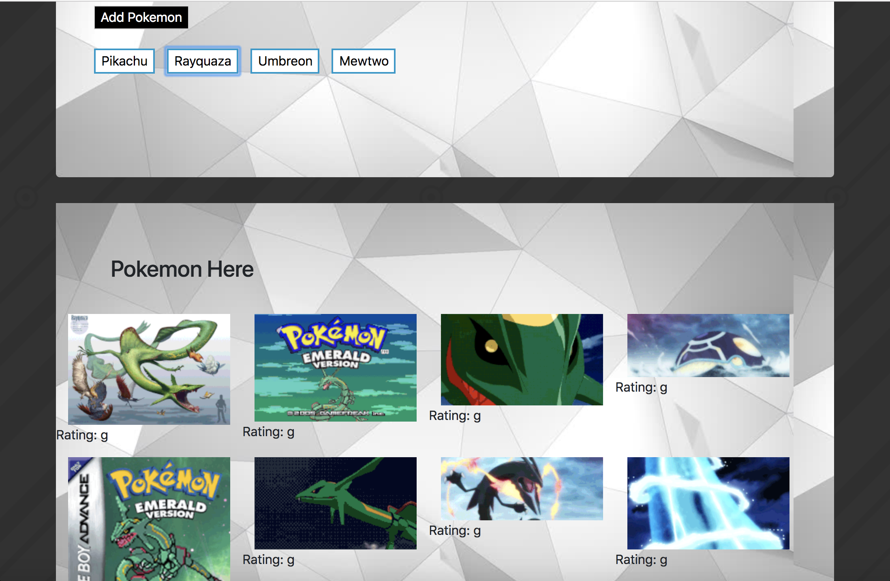

# Gif-Tastic

Pokemon themed gif generation program that uses Giphy API to obtain and show gifs related the pokemon selected.

[Pokemon Gif-Tastic](file:///Users/muhammadawais/Desktop/Gif-Tastic/index.html)

[Portfolio](https://mawais54013.github.io/Bootstrap-Portfolio/portfolio.html)

# Images


First display once program started.


After pokemon slected the gif show. 

# Technology Used
- HTML
- CSS
- Javascript
- Jquery
- Bootstrap
- Ajax

# Code Snippet
1) This snippet shows how ajax is used from the giphy API to get infromation about the title or the name of pokemon. 
```
var title = $(this).attr("data-name");
   
    var queryURL = "https://api.giphy.com/v1/gifs/search?q=" + title + "&api_key=4RorcUfXSl3tGRAM0Qf8PW68lgJbeqvE&limt=10";
   
    $.ajax({
        url: queryURL,
        method: "GET"
    }).then(function(response)
{
```

2) Every time a gif class item is clicked, this function will animate it. Then when the gif is clicked again, then the gif stops. 
```
$(".gif").on("click", function()
    {
        console.log(this);
        var state = $(this).attr("data-state");
        if(state === "still")
        {
            // if clicked then animate
            $(this).attr("src", $(this).attr("data-animate"));
            $(this).attr("data-state","animate");
        }
        else 
        {
            // if clicked again then it is paused
            $(this).attr("src", $(this).attr("data-still"));
            $(this).attr("data-state", "still");
        }
})
```

# Author 
[Muhammad Awais](https://github.com/mawais54013/Bootstrap-Portfolio)